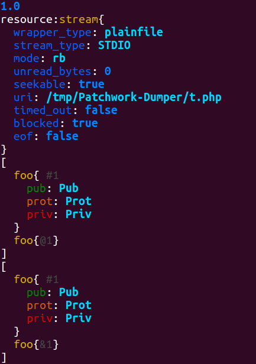

High accuracy and flexible dumping for PHP variables
====================================================

This package provides a better `debug()` function, that you can use instead of
`var_dump()`, *better* being for:

- per object and resource types specialized view: e.g. filter out Doctrine noise
  while dumping a single proxy entity, or get more insight on opened files with
  `stream_get_meta_data()`. Add your own dedicated `Dumper\Caster` and get the
  view *you* need.
- configurable output format: HTML, command line with colors or [a dedicated high
  accuracy JSON format](doc/json-spec-en.md).
  More to come / add your own.
- ability to dump internal references, either soft ones (objects or resources)
  or hard ones (`=&` on arrays or objects properties). Repeated occurrences of
  the same object/array/resource won't appear again and again anymore. Moreover,
  you'll be able to inspected the reference structure of your data.
- ability to operate in the context of an output buffering handler.
- full exposure of the internal mechanisms used for walking through an arbitrary
  PHP data structure.

Usage
-----

The recommended way to use this package is [through composer](http://getcomposer.org).
Just create a `composer.json` file and run the `php composer.phar install`
command to install it:

    {
        "require": {
            "symfony/debug-bundle": "~2.6"
        }
    }

Then enjoy debugging with `debug($var)`.

More advanced usages are possible. Please check the source code or open issues on
GitHub to get *how-to* answers.

Symfony2 bundle
---------------

For Symfony2 users, a bundle is also available. The bundle creates a `debug()`
function that is available both in your PHP code and in your Twig templates.

In console mode, variables are dumped on *stderr*. In web mode, variables are
dumped in a new `debug()` tab in the debug toolbar.

Enabling only needs a line in your `app/AppKernel.php`:

```php
public function registerBundles()
{
    $bundles = array(
        // ...
        new \Symfony\Bundle\DebugBundle\DebugBundle(),
    );
}
```

Example
-------

```php
<?php

require __DIR__ . '/vendor/autoload.php';

$var = 1.0;
debug($var);

$var = fopen(__FILE__, 'rb');
debug($var);

class foo
{
    public $pub = 'Pub';
    protected $prot = 'Prot';
    private $priv = 'Priv';
}

$foo = new foo;
$var = array($foo, $foo);
debug($var);

$var = array($foo);
$var[1] =& $var[0];
debug($var);
```


